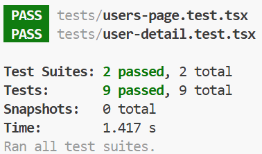
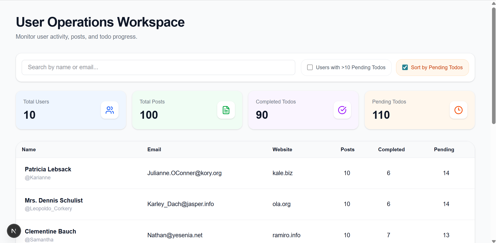
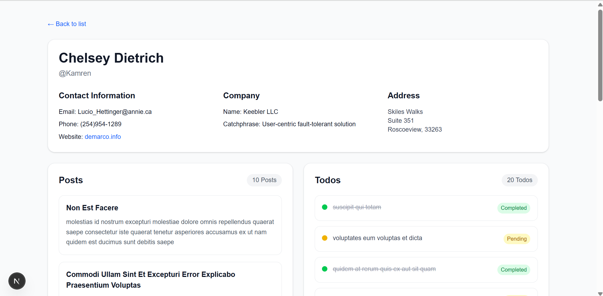
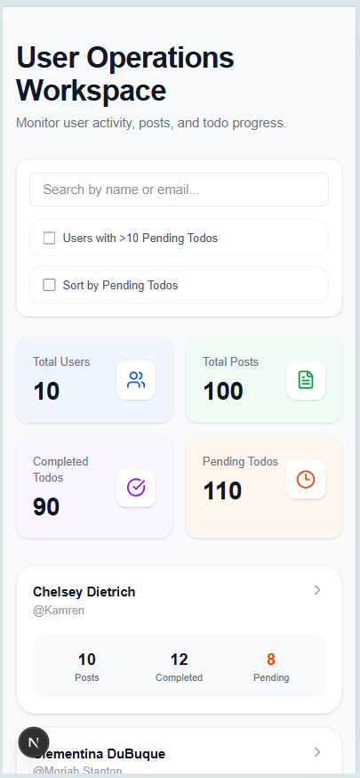
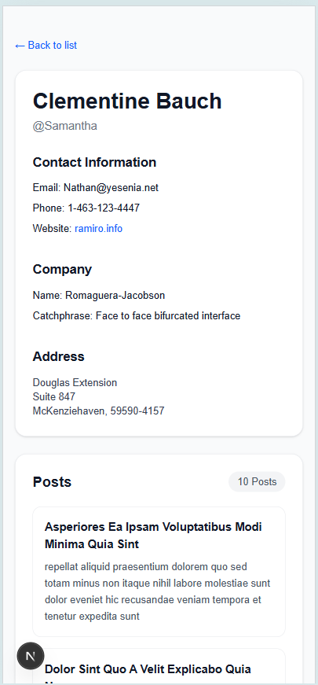

# Mampu User Operations Workspace
A modern and responsive User Operations dashboard built with **Next.js 15**, **TypeScript**, **Tailwind CSS**, and **Jest + React Testing Library**.

This project was developed as part of a Frontend Engineer Take Home Test (THT) to demonstrate:
- scalable frontend architecture
- responsive UI implementation
- data fetching & state handling
- testing practices
- clean user experience design

---
# ✨ Features
## Users List Page (`/users`)
- Fetch users from JSONPlaceholder API
- Display users in responsive desktop table & mobile cards
- Search users by name/email
- Filter users with >10 pending todos
- Sort users by pending todos
- Display derived activity signals
- Loading and empty states
- Error handling
- Responsive modern UI

---
## User Details Page (`/users/[id]`)
- Detailed user profile
- Contact, company and address information
- User posts and todos section
- Invalid user handling

---
## UI / UX Enhancements
- Modern dashboard-style design
- Fully responsive layout
- Accessible table semantics
- Focus states
- Hover interactions
- Empty state messaging
- Clean mobile experience

---
## Testing
Implemented using:
- Jest
- React Testing Library (RTL)

Covered test cases:
- Users rendering
- Derived activity signals
- Search filtering
- Pending filter
- Empty state
- User details rendering
- Posts & todos rendering
- Invalid/missing data handling

---
# 🛠️ Tech Stack
- Next.js 15 (App Router)
- TypeScript
- Tailwind CSS
- React Query
- Jest
- React Testing Library
- Lucide React Icons

---
# 📁 Project Structure
```bash
app/
└── users/
    ├── page.tsx
    └── [id]/
    └── error.tsx
    └── loading.tsx
    └── not-found.tsx
    └── page.tsx
components/
└── ui/
   ├── input.tsx
   └── loading.tsx
features/
└── users/
    ├── components/
    └── hooks/
lib/
├── react-query-provider.tsx
├── user-filter.ts
└── user-types.ts
services/
└── user-service.ts
tests/
├── mock-users.ts
├── setup.ts
├── user-detail.test.tsx
└── users-page.test.tsx
```

---

# 🚀 Getting Started

## 1. Clone Repository
```bash
git clone https://github.com/YOUR_USERNAME/mampu-user-operation-tht.git
```

---
## 2. Install Dependencies
```bash
npm install
```

---
## 3. Run Development Server
```bash
npm run dev
```
Open:
```bash
http://localhost:3000/users
http://localhost:3000/users/:id
```

---
# 🧪 Run Tests
```bash
npm test
```

Expected result:
```bash
PASS tests/users-page.test.tsx
PASS tests/user-detail.test.tsx
```
<p align="left">
  
</p>

---

# 🌐 APIs Used
JSONPlaceholder:
- https://jsonplaceholder.typicode.com/users
- https://jsonplaceholder.typicode.com/posts
- https://jsonplaceholder.typicode.com/todos

---
# 📸 Screenshots

## Users Page
<p align="left">
  
</p>

## User Detail Page
<p align="left">
  
</p>

## Users Page - Mobile Responsive View
<p align="left">
  
</p>

## User Detail Page - Mobile Responsive View
<p align="left">
  
</p>

---

# 📌 Notes
This project focuses on:
- clean architecture,
- maintainable component structure,
- modern responsive UI,
- frontend engineering best practices,
- and realistic user experience implementation.

---
**👩‍💻 Author** - Ayu Andini - Frontend Engineer Candidate